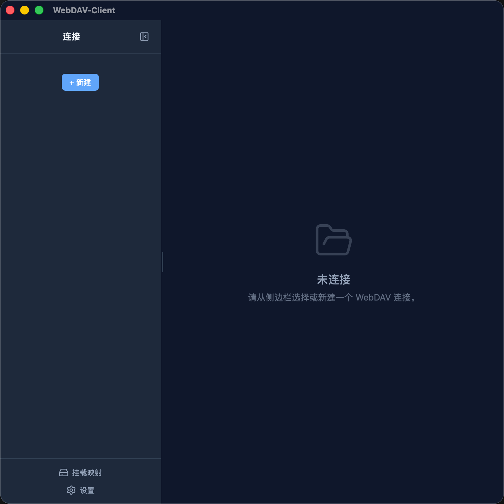

# WebDAV Client

**[简体中文](README.md)** | **English**

A cross-platform WebDAV desktop client built with Tauri 2 + Svelte 5, featuring file browsing, full-format preview, in-place editing, and upload/download.



## Features

- **Connection Management** — Save multiple WebDAV server profiles, switch with one click, test/edit/delete connections
- **File Browser** — Directory listing, breadcrumb navigation, sorting (name/size/modified), checkbox select-all/multi-select, supports Chinese paths and URL encoding
- **File Operations** — Upload, download, new folder, delete (with confirmation), rename, copy, move, batch operations and root directory support
- **Context Menu** — Right-click quick actions (rename/copy/move/download/delete)
- **File Preview**

  - Text/code files
  - Images (JPG/PNG/GIF/WebP/SVG) with large file size limits
  - PDF (page-by-page browsing)
  - Audio/Video (local HTTP streaming proxy, real-time playback with seek for large files)
  - Word documents (DOCX rendering)
  - Excel spreadsheets (XLSX rendered as HTML tables)
- **In-place Editing** — Edit text files directly and save back to WebDAV server
- **Auto Update** — Check GitHub Releases for updates on startup, manual check available in settings
- **Settings** — Language switch, theme switch, auto-update toggle, about & license info
- **i18n** — 7 languages: English / 简体中文 / 繁體中文 / 日本語 / 한국어 / Deutsch / Русский
- **Theme** — Light / Dark / Follow system
- **Sidebar** — Draggable width, collapse/expand, right-click menu for connection management
- **Icons** — All icons use lucide-svelte components
- **Performance** — Timeout protection on all network requests, request cancellation support

## Tech Stack

| Layer | Technology |
| ------ | ------ |
| Desktop Framework | Tauri 2 |
| Backend | Rust |
| WebDAV Protocol | reqwest_dav 0.3 |
| Frontend | Svelte 5 + TypeScript |
| Styling | Tailwind CSS 4 |
| Icons | lucide-svelte |
| i18n | svelte-i18n |
| File Preview | pdfjs-dist / docx-preview / SheetJS |

## Project Structure

```tree
src-tauri/src/              # Rust backend
  lib.rs                    # Tauri entry, command registration
  error.rs                  # Unified error types
  streaming.rs              # Local HTTP streaming proxy (video playback)
  webdav/
    client.rs               # WebDAV client wrapper
    types.rs                # Data type definitions
    mod.rs                  # AppState / StreamState
  commands/
    connection.rs           # Connection management commands
    files.rs                # Directory listing
    upload.rs               # Upload
    download.rs             # Download
    operations.rs           # File operations (delete/rename/copy/move)
    preview.rs              # Preview data fetching, video stream management
    edit.rs                 # Text editing read/write

src/lib/                    # Svelte frontend
  api.ts                    # Tauri invoke wrappers
  types.ts                  # TypeScript type definitions
  i18n/                     # Internationalization (Chinese / English)
    en.json
    zh-CN.json
  stores/                   # Svelte 5 runes state management
    browser.svelte.ts       # File browser state
    connections.svelte.ts   # Connection management state
    preview.svelte.ts       # Preview panel state (incl. video stream management)
    toast.svelte.ts         # Toast notifications
    theme.svelte.ts         # Theme switching
    dialog.svelte.ts        # Dialog state
    update.svelte.ts        # Auto-update checking
    version.ts              # Version number
  utils/file-types.ts       # File type detection and formatting
  components/
    layout/                 # Layout components (Sidebar/Toolbar/Breadcrumb)
    connection/             # Connection forms
    browser/                # File browser
    preview/                # Format-specific previewers (incl. VideoPreview custom controls)
    common/                 # Shared components (ContextMenu/ConfirmDialog/SettingsModal)
```

## Development

**Prerequisites:**

- Node.js >= 18
- Rust >= 1.77
- pnpm

```bash
# Install dependencies
pnpm install

# Start dev mode
pnpm tauri dev

# Production build
pnpm tauri build
```

## Acknowledgements

Thanks to all contributors:

<a href="https://github.com/iliucoco/rust-webdav-client/graphs/contributors">
  
</a>
